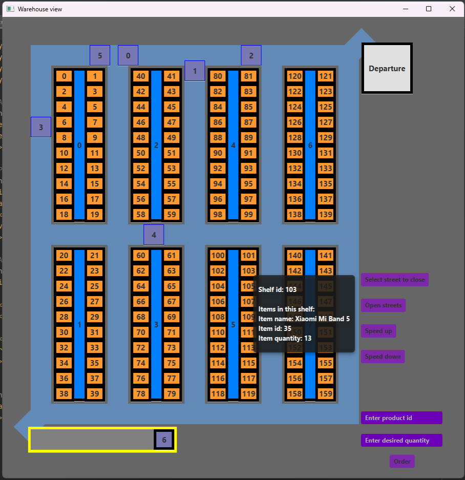

# Aplikácia pre zobrazenie vozíkov vo veľkosklade a sledovanie ich pohybu
**Členovia týmu:**
- Marián Backa (xbacka01)		- Vytvorenie prvotných dát(XML), načítanie a rozdelenie položiek v sklade, vykreslenie
- Vojtěch Soukenka(xsouke01)	- Pohyb vozíkov, vytvorenie a spracovanie požiadaviek

**Hodnotenie:**	65/80 bodov

**Verzia javy:**	Java8

**Spustenie:**	poskytnutá Ant konfigurácia			

### Krátky popis projektu:

Program si naplní a zobrazí sklad a automaticky vyšle 5 vozíkov na spracovanie objednávok získaných z orders.xml súboru.
Uživateľ môže vytvoriť nové objednávky, alebo zrýchlovať/spomalovať spracovanie požiadavkov, sledovať obsah vozíkov/skladu hovernutím kurzorom, poprípade
zavrieť uličku pomocou UI.

# Náhlad:

